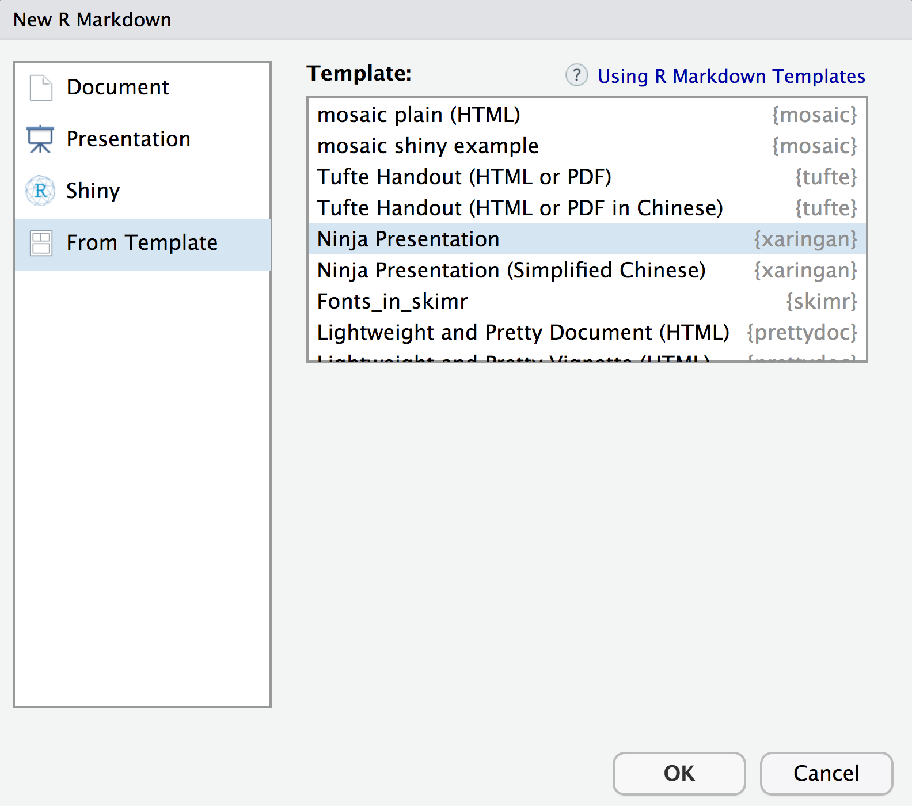

```{r setup, include=FALSE}
knitr::opts_chunk$set(echo = TRUE, warning = FALSE, message = FALSE, fig.retina = 3)
```


name: xaringan-title
class: center, middle
background-image: url(img/jelleke-vanooteghem-gc3sGgo3q1I-unsplash.jpg)
background-size: cover


# <span style="color: white;">Creating <br> Slides  with <br>`xaringan` </span>

### <span style="color: white;">Kelly McConville<br>ERWS 2020 </span>


---

name: tools
class: center, middle

# What tools do you currently use to create presentation slides?

---
class: center

## Slide Building Tools


---
class: center

## Slide Building Tools


---
class: center

## Slide Building Tools


---
class: center

## Slide Building Tools


--


<p style="font-family:Anton; color:rgba(250, 105, 0, 1)">Bottom Line: Learn multiple tools.</p>


---

## Why Learn `xaringan`?


`xaringan` is good to use if:

--

+ You want HTML slides.

<!-- INSERT LINK TO SLIDES! -->


---

## Why Learn `xaringan`?


`xaringan` is good to use if:


+ Have a lot of embedded R work.

```{r, echo= TRUE, warning = FALSE, message=FALSE, fig.height = 2.5, fig.width=5, eval = FALSE}
library(pdxTrees)
library(tidyverse)

# Isabelle's histogram of the inventory date 
count(pdxTrees_parks, Inventory_Date) %>%  
  ggplot(aes(x = Inventory_Date)) +   
  geom_histogram() 
```


```{r, echo= FALSE, warning = FALSE, message=FALSE, fig.height = 2.5, fig.width=5}
library(pdxTrees)
library(tidyverse)

# Isabelle's histogram of the inventory date 
pdxTrees_parks %>%   
  count(Inventory_Date) %>%  
  # setting the aesthetics
  ggplot(aes(x = Inventory_Date)) +   
  # specifying a histogram and picking color! 
  geom_histogram(bins = 50,               
                 fill = "darkgreen", 
                 color = "black") + 
  labs( x = "Inventory Date", 
        y = "Count", 
        title= " When was pdxTrees_parks Inventoried?") + 
  # adding a theme 
  theme_minimal() + 
  theme(plot.title = element_text(hjust = 0.5))
```


---

## Why Learn `xaringan`?


`xaringan` is good to use if:


+ You want to embed an interactive map or application:

```{R leaflet packages, echo = FALSE}
# loading the leaflet packages 
library(leaflet)
library(leaflet.extras)
```

```{r leaflet graph, fig.width= 6, fig.height=4,echo=FALSE}
# making the leaf popup icon 
greenLeaflittle <- makeIcon(
  iconUrl = "http://leafletjs.com/examples/custom-icons/leaf-green.png",
  iconWidth = 10, iconHeight = 20,
  iconAnchorX = 10, iconAnchorY = 10,
  shadowUrl = "http://leafletjs.com/examples/custom-icons/leaf-shadow.png",
 shadowWidth = 10, shadowHeight = 15,
 shadowAnchorX = 5, shadowAnchorY = 5
)
# filtering using dplyr to just Berkeley Park 
berkeley_prk <- pdxTrees_parks %>%
  filter(Park == "Berkeley Park")
# creating the popup label 
labels <- paste("</b>", "Common Name:",
                 berkeley_prk$Common_Name,
                 "</b></br>", "Factoid: ", 
              berkeley_prk$Species_Factoid) 
# creating the map 
leaflet() %>%
  # setting the lng and lat to be in the general area of Berekely Park 
 setView(lng = -122.6239, lat = 45.4726, zoom = 17) %>%  
  # setting the background tiles
  addProviderTiles(providers$Esri.WorldTopoMap) %>%
  # adding the leaf markers with the popup data on top of the circles markers 
  addMarkers( ~Longitude, ~Latitude, 
              data = berkeley_prk,
             icon = greenLeaflittle,
              popup = ~labels) %>%
  # adding the mini map at the bottom right corner 
  addMiniMap()
```

---

## Why Learn `xaringan`?


`xaringan` is good to use if:


+ You want to include an animated graph:

```{r, echo = FALSE}
library(gganimate)
```


```{r animated graph, echo = FALSE}
# refactoring the categorical mature_size variable 
berkeley_prk <- berkeley_prk %>%
 mutate(mature_size = fct_relevel(Mature_Size, "S", "M", "L"))
# first creating the graph using ggplot and saving it! 
berkeley_graph <- berkeley_prk %>%
  # piping in the data 
                  ggplot( aes(x = Tree_Height,
                              y = Pollution_Removal_value,
                              color = Mature_Size)) + 
  # creating the scatterplot 
                  geom_point(size =3  ) +
                  theme_minimal() + 
  # adding the labels 
                  labs(title = "Pollution Removal Value of
                       Berkeley Park Trees",
                       x = "Tree Height", 
                       y = "Pollution Removal Value ($'s anually)", 
                       color = "Mature Size") + 
  # adding a color palette 
                  scale_color_brewer(type = "seq", palette = "Set1") + 
  # customizing the title font
                  theme(plot.title = element_text(hjust = 0.5, 
                                                  size = 18,
                                                  face = "bold"))
```


```{R, out.width = "50%", echo =FALSE, cache=TRUE, fig.align='center'}
# then adding the animation with gganimate functions 
berkeley_graph + 
  # chosing which variable we want to annimate 
  transition_states(states = Mature_Size,
                    #how long each point stays before fading away 
                    transition_length = 10,
                    #the time the transition takes
                    state_length = 8)  +    
  #annimation for the points entering
  enter_grow() +      
  #annimation for the points exiting
  exit_shrink()                           
```

---

## Why Learn `xaringan`?


`xaringan` is good to use if:


+ Want to ensure you are using a reproducible workflow.
    

---

## `xaringan` Demystified

 Slides edited in an R Markdown document. 

--


Knits to HTML.

--

**If you have worked with an R Markdown document before, you can create `xaringan` slides!**

---

## How do I create slides?

.pull-left[

- First slides starts where the YAML (header stuff) ends

- `---` = New Slide


]

.pull-right[

```
---
output: xaringan::moon_reader 
---

# Header on Slide 1

Some stuff

---

# Header for Slide 2 

More stuff

```
]

---

## `xaringan` Demystified


* Let's grab some template slides: 
    + File > New File > R Markdown ... 

```{r, echo = FALSE, out.width = "400px", fig.align='center'}

```

---

## `xaringan` Tips!

* RStudio Addin: *xaringan: Infinite Moon Reader*.
    + Updates the slides

--
    
* Press ? to see shortcuts.

--

* Use `--` for incremental builds.  (.bright-orange[Warning:] It is fussy!) 


---

## `xaringan` Tips!


.pull-left[


 To create two columns, use `.pull-left[ ]` and `.pull-right[ ]`


]

.pull-right[

```
---

## `xaringan` Tips!


.pull-left[

Stuff


]

.pull-right[

Other stuff

]
```

]


---

## References

* To add in citations:

```{r}
library(RefManageR)
BibOptions(
  check.entries = FALSE, 
  bib.style = "authoryear", 
  cite.style = "authoryear", 
  style = "markdown",
  hyperlink = FALSE, 
  dashed = FALSE)
bibfile <- ReadBib("xaringan.bib")
```

* For inline citations:
  + Using `Citet()`: `r Citet(bibfile, "xie20")`
  + Using `Citep()`: `r Citep(bibfile, "xie20")`
  + Using `NoCite()`: `r NoCite(bibfile, "xie20")`

```{r, include = FALSE}
NoCite(bibfile, "tarr19")
NoCite(bibfile, "r19")
NoCite(bibfile, "hill19")
```


---

## Bibiliography

```{r, echo = TRUE, results = 'asis'}
PrintBibliography(bibfile)
```


---

## General Slide Creation Tips

--

* Creating good slides does take .bright-orange[effort] and should include .bright-orange[revisions].

--

* Use a `r emo::ji("picture")` or `r emo::ji("graph")` over text whenever possible.

--

* Know your audience.

--

.pull-left[

$$
\begin{aligned}
\boldsymbol{\hat{\beta}}_s = & \underset{\boldsymbol{\beta}}{\arg\min}  \left\{ \sum_{i \in s} \frac{(y_i - \boldsymbol{x}_i^T \boldsymbol{\beta})^2}{ \sigma^2_i} \right.\\
& \left. + \lambda \left[ \alpha \sum_{j=1}^p \left|\beta_j\right| + (1-\alpha) \sum_{j=1}^p \beta_j^2\right] \right\}
\end{aligned}
$$


] 


--


.pull-right[


]

---

## Resources

* I learned `xaringan` (and borrowed heavily for this presentation) from [Alison Hill's online materials](https://alison.rbind.io/) 

--

* [Yihui Xie's (the package developer) introduction](https://slides.yihui.org/xaringan/#1) to `xaringan`


--

* `xaringanthemer`: Great package for easily change the theme without needing to learn CSS.


